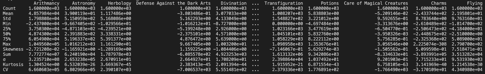
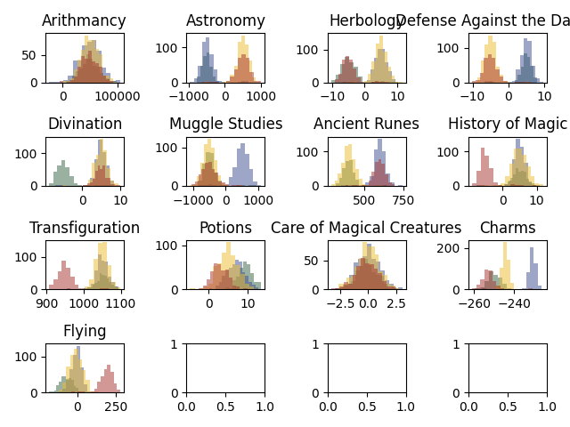
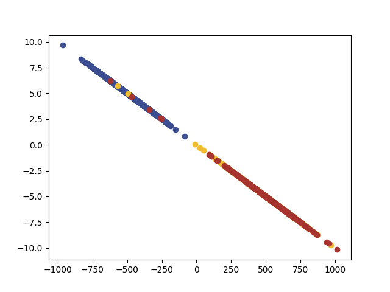

# DSLR
ML classification model implementing a Logistic Regression

The idea of this *42cursus* project is that the Harry Potter's Sorting Hat has been lost. So, having the data from Hogwarts students, you should be able to train a Logistic Regression algorithm that can "learn" by its own how the Sorting Hat selects every student to their houses. 

## Requirements

```bash
pip3 install -r requirements.txt
```

## Data

There are two different *datasets*. The one used to train the Logistic Regression and the one to get predicted.

## Data Analysis

The first part of the project is the data analysis. It is a program that displays several statistics for every feature in the dataset.



#### Usage

```bash
python3 data_analysis/describe.py datasets/dataset_train.csv
```


## Data Visualization

In order to know information about the relations between data. This will allow us to know what features are really relevant to use during our training phase.

This programs will answer specific questions about data.

### Histogram

*Which Hogwarts course has a homogeneous score distribution between all four houses?*



#### Usage

```bash
python3 data_visualization/histogram.py datasets/dataset_train.csv
```

### Scatter Plot

*What are the two features that are similar ?*



#### Usage

```bash
python3 data_visualization/scatter_plot.py datasets/dataset_train.csv
```

### Pair Plot

*From this visualization, what features are you going to use for your logistic regression?*


#### Usage

```bash
python3 data_visualization/pair_plot.py datasets/dataset_train.csv
```

After this analysis, we can conclude what data really matters for our training.

## Logistic Regression

#### Sigmoid Function

The Sigmpoid Function is used to predicting if the an element belongs to a class (*0* or *1*). It is what is adjusted to differentiate both classes.

=\frac{1}{1&plus;e^{-\theta\cdot&space;x'}})


#### Cost-Loss Function

This is the function that evaluates the mean error at predicting the values. 

=-\frac{1}{m}\sum_{i=0}^{m}y^{i}log(h_{\theta}(x^{i}))&plus;(1-y^{i})log(h_{\theta}(x^{i})))

### Training

The [logreg_train](./logistic_regression/logreg_train.py) generates a `.weights.csv` file where `thetas` are stored. These are the weights that multiplies every feature value to know how much each value is taken into account.

#### Stochastic GD

There is a feature in order to use a *stochastic gradient descent* algorithm. You can set the class init value of stochastic to true like this:

```python
lr = logReg(thetas, stochastic=True, batch_size=32)
```

This will make the class to use the stochastic function at fit. This function consists on using "batches" of data to evaluate the fit, so this will make it more efficient.

#### Usage

```bash
python3 logistic_regression/logreg_train.py datasets/dataset_train.csv
```

### Accuracy

The [logreg_accuracy](./logistic_regression/logreg_accuracy.py) takes the `thetas` and makes its prediction over the data where the real results are already known in order to know the accuracy the algorithm has and shows it as a percentage of sucess.

#### Usage

```bash
python3 logistic_regression/logreg_accuracy.py datasets/dataset_train.csv
```

### Prediction

The [logreg_predict](./logistic_regression/logreg_predict.py) takes the `thetas` to do the prediction over the dataset where the students does not have an assigned house. When the prediction is realized over all the stdudents, the program generates a `houses.csv` where all the predicted houses are stored.

#### Usage

```bash
python3 logistic_regression/logreg_predict.py datasets/dataset_test.csv
```

## Resources

https://en.wikipedia.org/wiki/Logistic_regression

https://christophm.github.io/interpretable-ml-book/logistic.html

https://www.geeksforgeeks.org/understanding-logistic-regression/

https://www.analyticsvidhya.com/blog/2020/04/feature-scaling-machine-learning-normalization-standardization/
